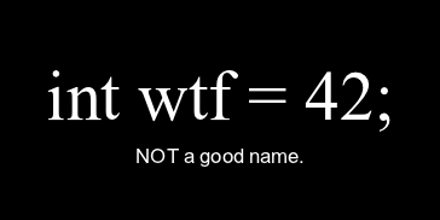

# 📫 Definiciones con sustantivos

## Expresa claramente una intención.

> "Da sentido mediante los nombres."
>
> -- ✍️ **Quien lo vaya a leer**

---

## 🌄 Objetivo: Claridad

### Mostrar la INTENCIÓN

#### 🏬 Explica lo que vas a almacenar.

---

### Para variables / propiedades / constantes / clases

- Emplear siempre palabras **completas** y descriptivas.

- Para que sean **pronunciables y corregibles** ortográficamente.

- 📚 Vocabulario de **entidades y propiedades** de negocio: _Lenguaje ubicuo_.

- **Sin** prefijos o sufijos técnicos.

- Lo siento Harry, pero mejor sin magia. 🧙

---

### 🔮 Reduce WTF!

❌ **No magic numbers**.

---

- [⏭️ Next: 💪 4 - Acciones con verbos](./4-acciones_con_verbos.md)
