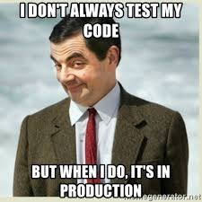

# ✅ Software que funciona

### Mejora tu código sin miedo.

> "Codifica como si la persona que mantendrá tu código fuera un psicópata violento que sabe dónde vives."
>
> -- ✍️ **Martin Golding**

---

## 🧪 Limpiar requiere cambiar por dentro sin cambiar por fuera

- Necesitamos pruebas para limpiar **tranquilos**.
- Haz algún tipo de prueba, pero **¡haz pruebas!**.
- En _front_, mejor empieza por **integración**.
- Los tests **son automáticos**.
- Los tests **deben estar limpios**.

--

> "[Write tests. Not too many. Mostly integration.](https://kentcdodds.com/blog/write-tests)"
> -- ✍️ **Kent C. Dodds**

---

### Si funciona...

---

> "¿Por qué los desarrolladores temen cambiar su código?
>
> Porque ¡Tienen miedo a que se rompa!
>
> ¿Por qué tienen miedo de romperlo?
>
> Porque no tienen pruebas.
>
> Si funciona, y tienes pruebas, tócalo."
>
> -- ✍️ **Robert C. Martin**

---

> "La verdad sólo se encuentra en un lugar: el código"
>
> -- ✍️ **Robert C. Martin**

---

- [⏭️ Next: ✅ NAME](./1-name/1-estilo_y_orden.md)
