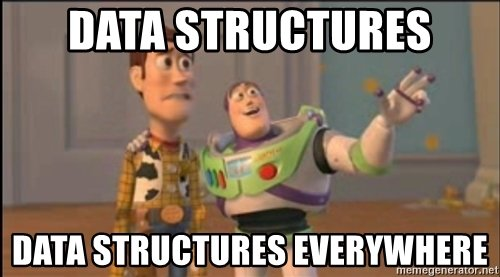

# 🔱 Condiciones y algoritmos

## Simplificación de algoritmos.

> "Algoritmos + Estructuras de datos = Programas"
>
> -- ✍️ **Niklaus Wirth**

---

## 🔨 Usa estructuras de **datos** que eviten el uso de estructuras **condicionales**

### El `if` y, sobre todo, el `switch` huelen mal 🤢

- Reduce los `if` encapsulando las comprobaciones en estructuras 🔏.
- Reduce los `if` evitando 🕳️ nulls.
- Sustituye un 🔱`switch` por un objeto, un array o un mapa.

---

---

- [⏭️ Next: 🗃️ Cohesión de primitivos](./2-cohesion_de_primitivos.md)
